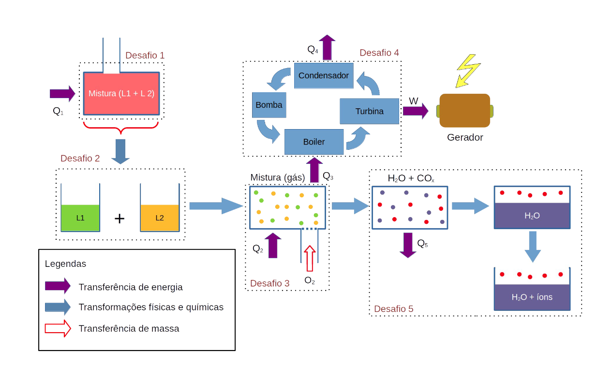
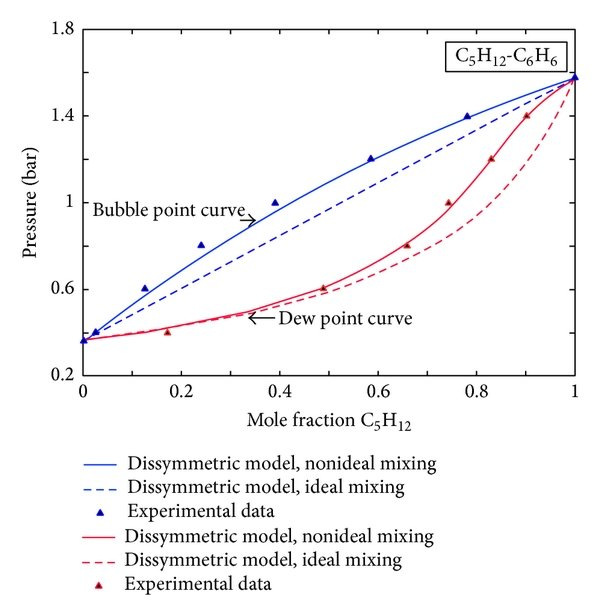

# Termodinamica avançada

## Introdução

Esse trabalho será realizado durante a disciplina de termodinâmica avançada da Ilum escola de Ciência. O problema proposto é entender e estudar conceitos de potenciais termodinâmicos e interações moleculares a partir do estudo do Ciclo de Rankine. O ciclo Rankine é um processo termodinâmico que é a base de usinas a vapor que geram energia elétrica. Esse ciclo é constituído das seguintes etapas: i) um fluído de alta pressão é bombeado para dentro do ciclo (ii) e entra em uma caldeira, onde calor é adicionado a pressão constante para o líquido comprimido. iii) o vapor atinge a turbina, onde se expande adiabaticamente, esfria e acaba na pressão baixa original. (iv) Finalmente, o fluido parcialmente condensado é resfriado ainda mais em um condensador. (Schroeder, 1999)(Miller, 2011)
Além disso, como observável no diagrama abaixo, outras fases anteriores e posteriores ao ciclo de Rankine também serão estudados. 

## Primeiro desafio

O primeiro desafio proposto é a escolha de uma mistura com potencial para fornecimento de energia ao ciclo Rankine (responsável pela geração de energia elétrica). A mistura escolhida pela dupla foi o Pentano(C5H12) e o Benzeno(C6H6).

Para escolher a mistura adequada, foram considerados quatro critérios principais. O primeiro critério foi a entalpia, que mede a energia térmica envolvida na mistura. O segundo critério foi a disponibilidade de um diagrama de fases para a mistura, que nos dá a relação entre as fases de uma substância em várias temperaturas e pressões (McQuaire e Simon, 1957) . Esse diagrama será essencial nas próximas etapas do trabalho. Como não haverá experimentos para coletar os dados, é necessário ter um diagrama de fases pronto para viabilizar os estudos.

Seguindo a mesma linha, o terceiro critério foi a "popularidade" dos componentes da mistura. Optamos por utilizar benzeno e pentano, substâncias amplamente conhecidas e estudadas, cujas informações são facilmente acessíveis. Isso facilitará a obtenção dos dados necessários para o projeto, como a entalpia.

Por fim, o quarto critério foi o baixo ponto de vaporização dos elementos da mistura. O Ciclo Rankine funciona a partir da energia gerada pelo vapor, de modo que quanto menor a temperatura de vaporização, menor será a energia necessária para aquecer e vaporizar a mistura. Tanto o benzeno quanto o pentano apresentam pontos de vaporização relativamente baixos, o que os torna bons candidatos para aplicação no Ciclo Rankine. A temperatura de vaporização do benzeno é 80.1°C e do pentano é 36.1°C (quase em temperatura ambiente).

  

